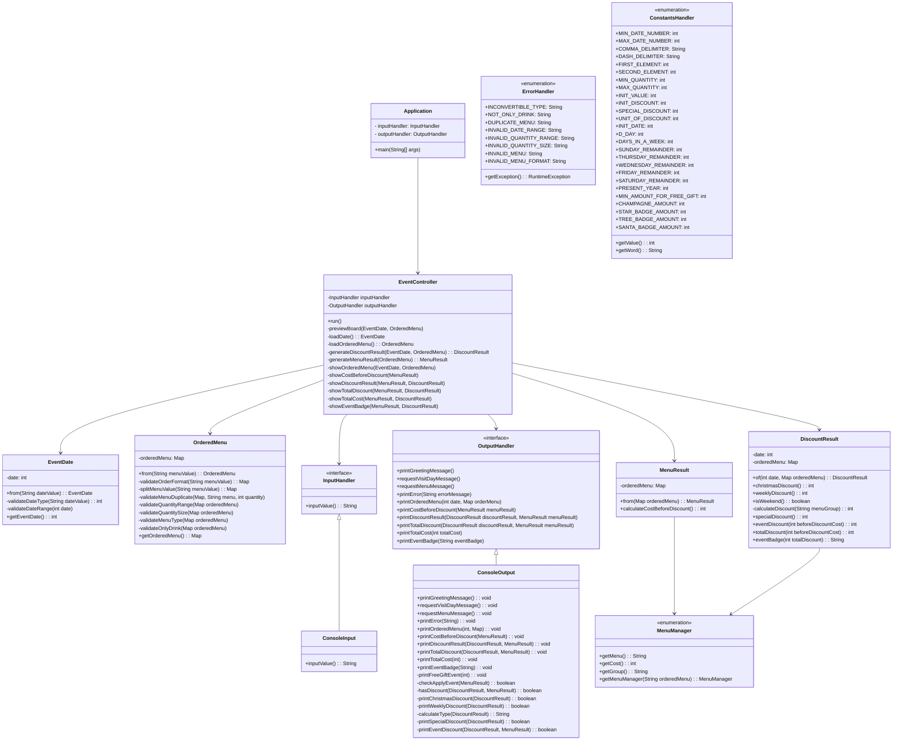

# 🎄 우아한테크코스 프리코스 4주차 : 크리스마스 프로모션

## 목차

- [1. 구현 기능 목록](#ballotboxwithcheck-구현-기능-목록)
- [2. 문제 해결 과정](#bookmark_tabs-문제-해결-과정)
   - [2.1 🧪 3주 차 미션 피드백](#-3주-차-미션-피드백)
   - [2.2 🤔 재귀와 반복문](#-재귀와-반복문)
   - [2.3 👻 printError 메서드 활용](#-printerror-메서드-활용)
      
# :ballot_box_with_check: 구현 기능 목록

- [x] controller Package
   - [x] EventController
      - view Package와 domain Package의 데이터를 전달하며 값을 출력하는 클래스

- [x] domain Package
   - [x] DiscountResult
      - 날짜에 따른 할인을 적용하는 클래스
   - [x] MenuManager
      - 메뉴와 메뉴의 가격, 메뉴의 그룹을 Enum으로 관리하는 클래스
   - [x] MenuResult
      - 주문받은 메뉴와 메뉴 개수를 활용하여 주문 금액을 구하는 클래스
   - wrapper Package
      - [x] EventDate
         - 입력받은 날짜에 대한 유효성 검사와 반환을 담당하는 클래스
      - [x] OrderedMenu
         - 주문받은 메뉴와 메뉴 개수에 대한 유효성 검증과 반환을 담당하는 클래스

- [x] handler Package
   - [x] InputHandler
      - view Package의 ConsoleInput의 확장성과 변경 용이성을 위한 인터페이스
   - [x] OutputHandler
      - view Package의 ConsoleOutput의 확장성과 변경 용이성을 위한 인터페이스
   - [x] ErrorHandler
      - Enum 클래스를 활용하여 프로그램에서 발생하는 에러 코드들을 관리하는 클래스
   - [x] ConstantsHandler
      - 프로그램내의 상수들을 관리하는 클래스

- [x] view Package
   - [x] ConsoleInput
      - 입력을 담당하는 클래스
   - [x] ConsoleOutput 
      - 출력을 담당하는 클래스

---

# :bookmark_tabs: 문제 해결 과정

## 🧪 3주 차 미션 피드백

➡️ 다음은 첫 번째 피드백 내용이다. 이러한 피드백 내용에 따라 처음에는 enum으로 작성하지 않았던 `ConstantsHandler` 를 enum 클래스로 리팩토링을 진행했다. 

🔸 (**@Hugh-KR**) : 모든 상수를 일반 클래스에 상수 형태로 모아놓는 전략을 사용하셨네요. 좋은 방식이라고 생각합니다.

이번 로또 미션을 진행하면서. enum을 사용하라 라는 요구사항의 의미를 생각해 봤어요.

구현하신 상수 중에는 MIN_PURCHASE_AMOUNT, REMAINDER 가 있습니다.

이 둘은 다른 용도로 사용되는 값이고 비교 시 False 가 나와야 한다고 생각해요. 그런데 현재 로직에서는 True가 나올 것이고 이는 프로젝트의 확장을 고려했을 때 예기치 못한 문제를 발생할 수 있다고 생각합니다.

enum을 사용하면 모든 상수는 하나의 인스턴스로써 사용되고 비교 시 False를 반환하며 앞서 말씀드린 문제를 해결할 수 있습니다. 그래서 저도 enum을 사용했구요.

학습한 지식을 공유하고 싶은 마음에 말씀드립니다. 간단하게 참고만 부탁드려요. 😄

🔹 (**본인**) : 생각지 못한 부분이어서 놀랐습니다😲 저도 같은 값을 나타내지만 다른 의미로 쓰이는 상수들이 불편하다고 느꼈는데 그 부분에서 더 깊이 생각하신 것 같아요! 이번 4주 차에도 일반 클래스로 작성했지만, enum으로 리팩토링을 해봐야겠습니다!

➡️ 두 번째 피드백 내용은 구현 기능 목록이다. 3주 차까지 내부의 메서드 모두 표현하는 걸 목표로 했지만, 메서드가 많아질수록 효율적이지 못하다는 생각에 이번 미션에서는 패키지의 구성과 클래스가 하는 일만 간략하게 나타내는 방식으로 진행했다.

🔸 (**@Hugh-KR**) : 정말 꼼꼼한 기능 구현 목록이네요. 고민의 흔적이라고 생각합니다. 그런데 조금 많은 정보를 담고 있는 것이 아닌가 하는 생각이 들었어요. 그 부분을 고민해 보시면 어떨지 하는 생각이 들었습니다.

🔹 (**본인**) : 좋은 의견 감사합니다! 창혁님 말씀 듣고 4주 차를 진행해 본 결과 메서드가 많아질수록 효율적이지 못한 것 같더라고요! 그에 따라서 패키지의 구성만 나타내기로 했습니다👍

## 🤔 재귀와 반복문

🔹 3주 차 미션부터 잘못된 입력값을 받은 경우 그 부분부터 입력을 다시 받는다는 내용이 명시되어 있다. 이러한 요구사항을 해결하기 위해 재귀와 반복문을 고민했고, 그중 반복문을 활용하여 코드를 구현했다. 반복문을 활용한다면 조건을 두고 반복을 빠져나올 수 있기 때문에 했던 선택이었는데 다른 분들이 서로 리뷰한 내용을 통해 재귀와 반복문에 대해 다른 의견도 알 수 있었다.

🔸 (@**jhon3242**) : 재귀를 사용한다면 반복문을 제거해줄 수 있어서 가독성에 더 좋을 것 같아요!

물론 성능상은 조금 안좋지만 가독성 측면에서 이득을 취할 수 있습니다! 😁

🔹 (@**packdev937**) : 좋은 말씀 감사합니다 : ) 사실 저도 처음에는 재귀로 구현했는데요, 자바 특성 상 1000번이 넘어가면 StackOverFlow가 발생하더라구요! 여러 예외 상황에 대해서 깊게 생각하다 보니 자연스럽게 while로 구현하게 되었습니다!

## 👻 printError 메서드 활용

🔹 저번 미션에서 반복문을 사용하는 Controller 내부에 UI 로직을 사용했다. 하지만, Controller 내부에 UI를 담당하는 부분이 있으면 안 되기 때문에 이번 미션에서는 `OutputView`에 `printError` 메서드를 구현하여 에러 메시지를 넘겨주는 방식으로 리팩토링했다. 